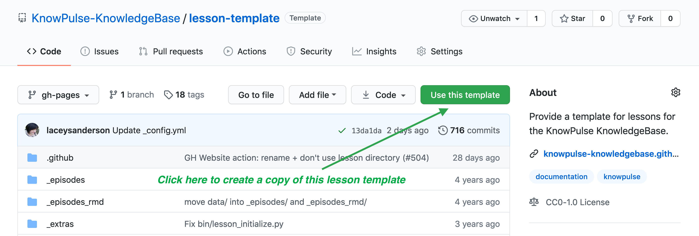
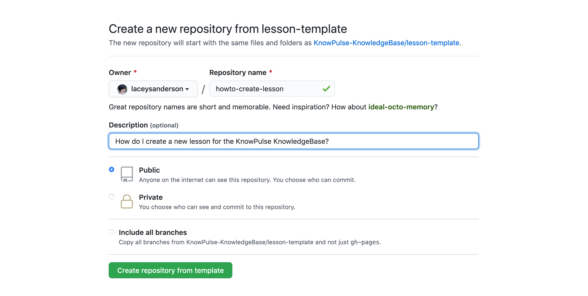

## Episodes

An episode is a cohesive block of tasks which map to a single step in your lesson. These tasks should flow well and teach a set of related concepts. For example, if you are creating a lesson on using Galaxy to extract FASTA records from a file, a great first episode would be an introduction to Galaxy. This one episode may contain many tasks such as logging in, exploring tool offerings and uploading data. All tasks within an episode should be connected by a common thread (i.e. orientation to galaxy). The estimated time it takes to teach should be less then 15 minutes, although activities completed by learners can take longer. Episodes within a lesson can be dependent on earlier episodes and are generally taught in sequence.

## Lessons

A lesson is a collection of episodes that together help the learner answer a particular research question. Each lesson should include all the information needed to complete the task. While some may include tasks executed on KnowPulse, not all must as the primary goal is to answer the question completely including how to prepare data for entry into tools and how to analyze their results.

## Philosophy

Our lessons are inspired by the Carpentries-style of teaching. For additional support materials on how to create good lessons, see their [Hanbook for Curriculum Development](https://carpentries.github.io/curriculum-development/) and their paper [Best Practices for Scientific Computing](http://journals.plos.org/plosbiology/article?id=10.1371/journal.pbio.1001745).

## Create your own lesson repository!

Go to [https://github.com/KnowPulse-KnowledgeBase/lesson-template](https://github.com/KnowPulse-KnowledgeBase/lesson-template) and click on **Use this template** to create a copy of the lesson template in your own Github space.

Github will then ask you to title your lesson repository.

- The name should be very short and not include any spaces. Typically, we use dashes between words for easy readability.
- The description should then be the full question your lesson is going to answer.

