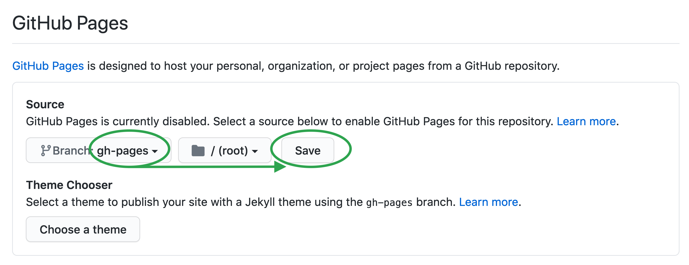

## Make it a website!

Next, we want to setup [Github Pages](https://pages.github.com/). This is how your lesson will be made into a professional website for free! And even better, setting it up is as easy as changing the settings on your repository!

First, go to settings in the top menu bar at the far right.

This is where you can change any settings for your repository but for our purposes we are going to scroll down on the first page to where is says **Github Pages**. Just click on the drop-down saying **None** and change it to **gh-pages**. Then click **Save**. DO NOT set a theme.

This will then trigger an automatic build of your website and after a minute or so, the settings will provide you a link to your website (blue highlighted section)!

Copy the link and add it to your repository main page. This is done by clicking on the gear beside about which will bring up the following edit form. Paste the URL in the website box and add the tags: **knowpulse-knowledgebase, knowpulse, lesson**. The tags will help us and others find your repository!

Finally, open the link in a new browser tab and your default webpage should be ready! This will be automatically updated everytime you commit (i.e. save) changes to your repository.

**NOTE: It takes a couple minutes to see the changes reflected in your webpage after you commit/save changes to it.**
