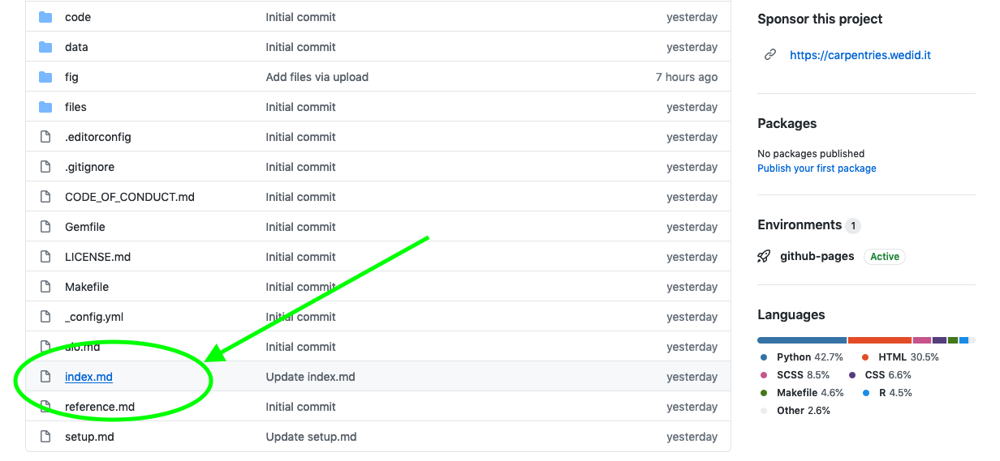
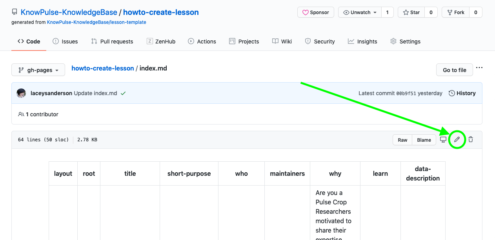
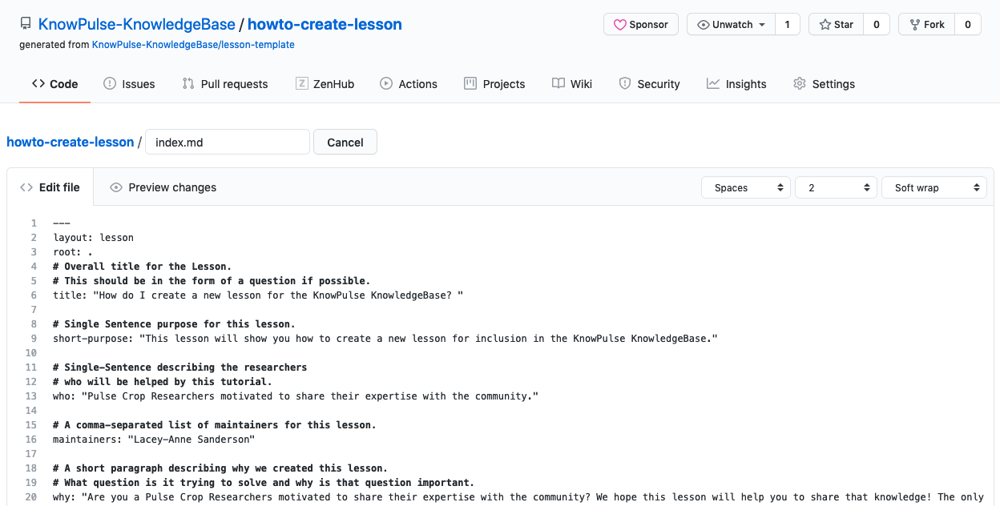
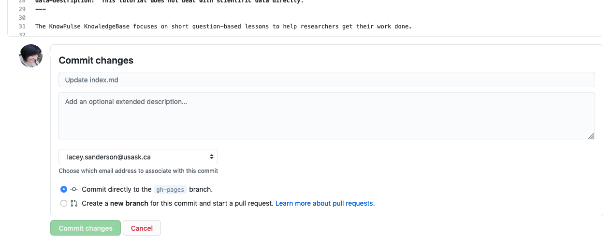

When you made your lesson a website you may have noticed the main page contained placeholder text which did not apply to your lesson. If you did then you may be wondering how to replace this text with useful information!

Luckily it's as easy as editing the `index.md` file and replacing the top metadata with information about your lesson!

To do this, click on the `index.md` filename, then click on the edit pencil in the top, right corner.

This will bring up a page where you can enter the details for your lesson. There are comments (prefixed with `#`) to help you.

Once you are done, click commit at the bottom of the page and your lesson will be automatically updated within a couple minutes.

