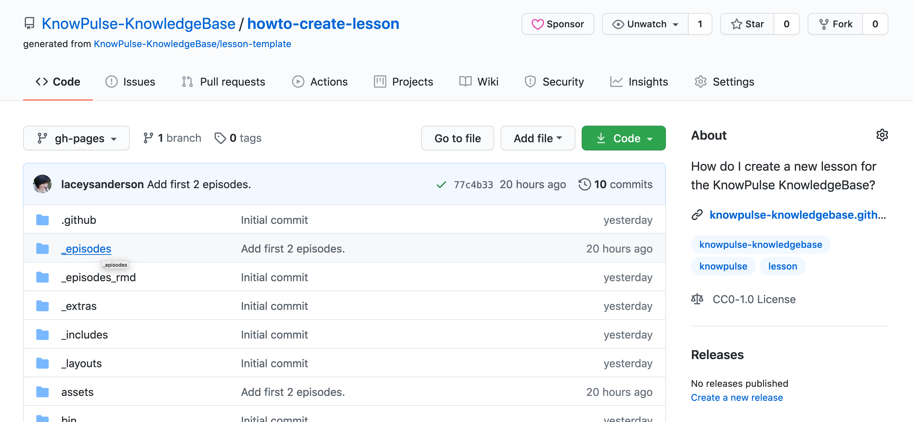
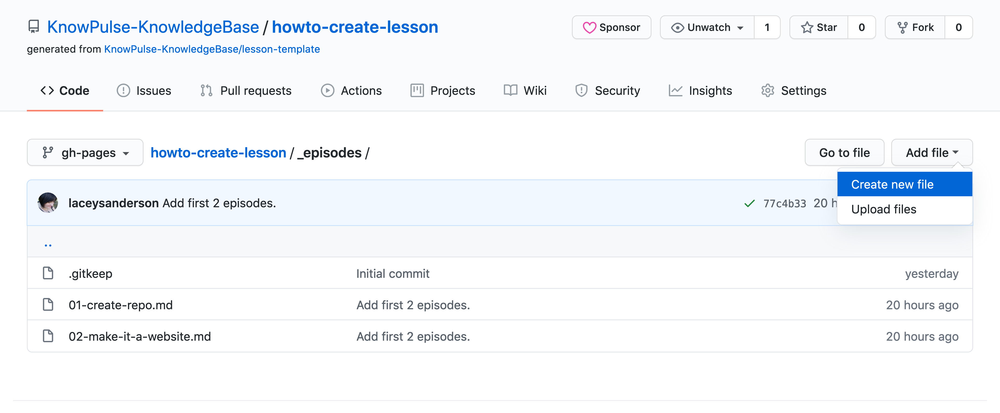
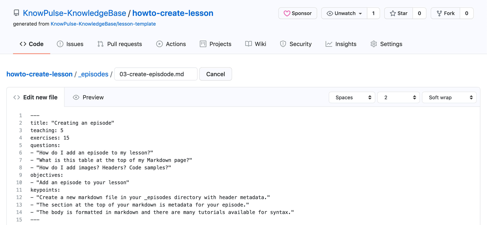
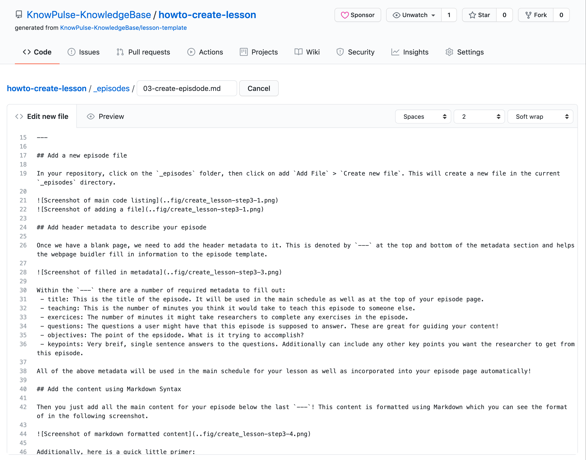
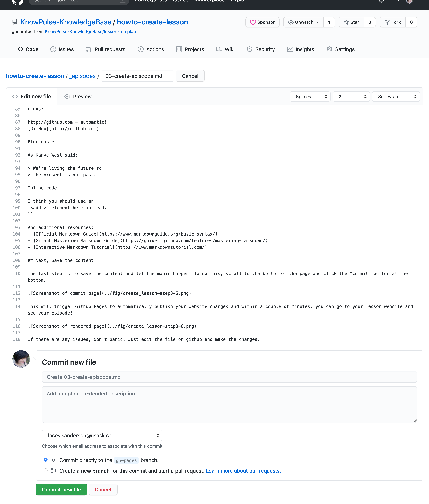
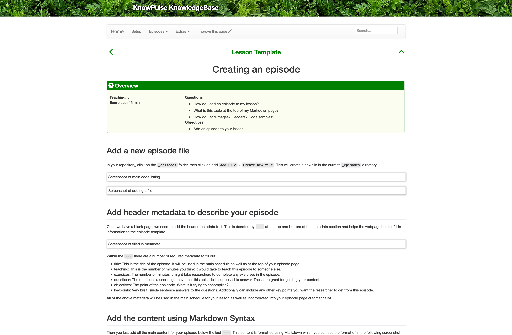
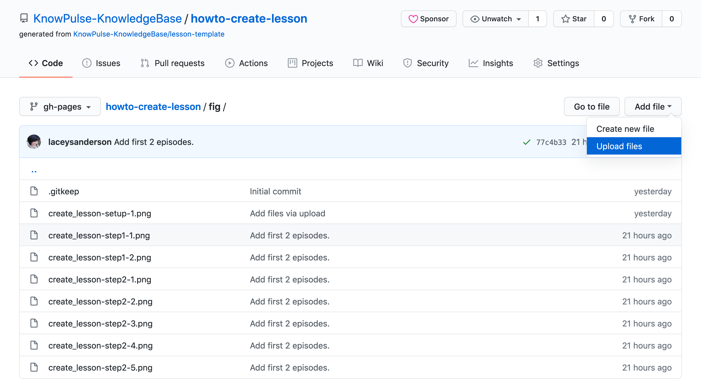
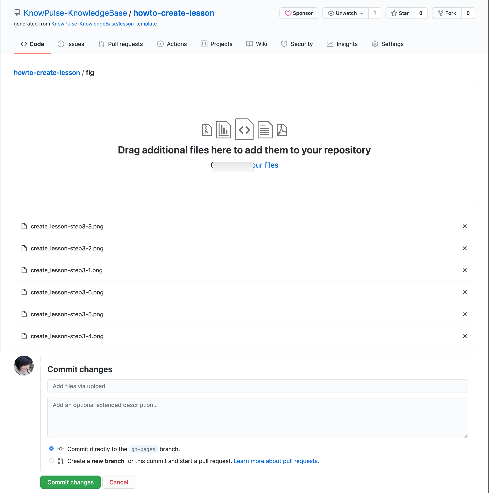
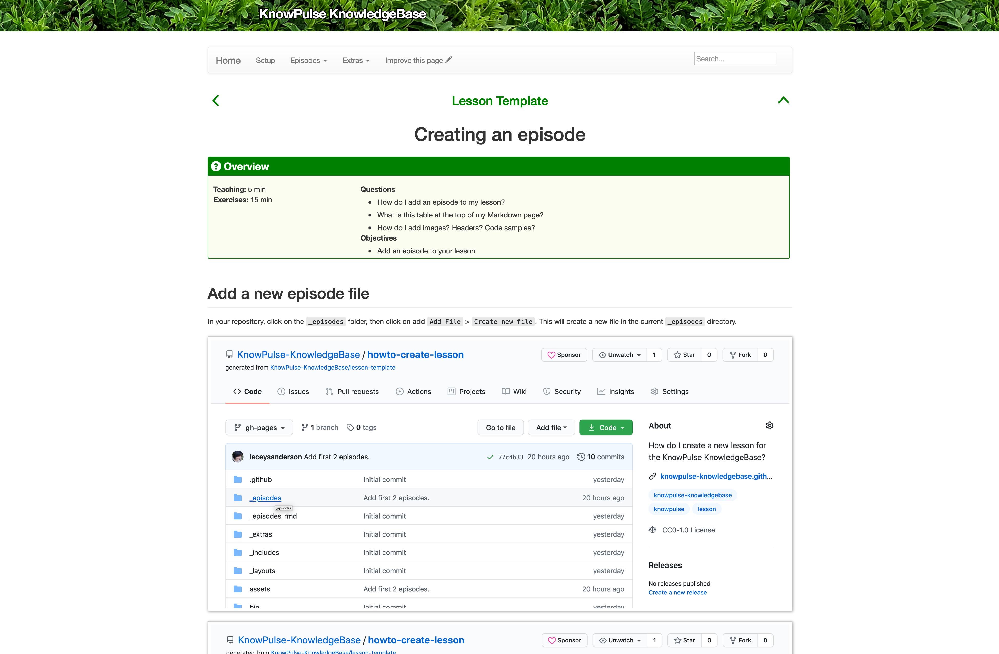

## Add a new episode file

In your repository, click on the `_episodes` folder, then click on add `Add File` > `Create new file`. This will create a new file in the current `_episodes` directory.




## Add header metadata to describe your episode

Once we have a blank page, we need to add the header metadata to it. This is denoted by `---` at the top and bottom of the metadata section and helps the webpage buidler fill in information to the episode template. 



Within the `---` there are a number of required metadata to fill out:
 - title: This is the title of the episode. It will be used in the main schedule as well as at the top of your episode page.
 - teaching: This is the number of minutes you think it would take to teach this episode to someone else.
 - exercices: The number of minutes it might take researchers to complete any exercises in the episode.
 - questions: The questions a user might have that this episode is supposed to answer. These are great for guiding your content!
 - objectives: The point of the epsidode. What is it trying to accomplish?
 - keypoints: Very breif, single sentence answers to the questions. Additionally can include any other key points you want the researcher to get from this episode.

All of the above metadata will be used in the main schedule for your lesson as well as incorporated into your episode page automatically!

## Add the content using Markdown Syntax

Then you just add all the main content for your episode below the last `---`! This content is formatted using Markdown which you can see the format of in the following screenshot.



Additionally, here is a quick little primer:
```
Headers:

# This is an <h1> tag
## This is an <h2> tag
###### This is an <h6> tag

Emphasis:

*This text will be italic*
_This will also be italic_

**This text will be bold**
__This will also be bold__

_You **can** combine them_

Lists:
Unordered:

* Item 1
* Item 2
  * Item 2a
  * Item 2b

Ordered:

1. Item 1
1. Item 2
1. Item 3
   1. Item 3a
   1. Item 3b

Images:


Format: 

Links:

http://github.com - automatic!
[GitHub](http://github.com)

Blockquotes:

As Kanye West said:

> We're living the future so
> the present is our past.

Inline code:

I think you should use an
`<addr>` element here instead.
```

And additional resources:
- [Official Markdown Guide](https://www.markdownguide.org/basic-syntax/)
- [Github Mastering Markdown Guide](https://guides.github.com/features/mastering-markdown/)
- [Interactive Markdown Tutorial](https://www.markdowntutorial.com/)

## Next, Save the content

The last step is to save the content and let the magic happen! To do this, scroll to the bottom of the page and click the "Commit" button at the bottom. 



This will trigger Github Pages to automatically publish your website changes and within a couple of minutes, you can go to your lesson website and see your episode!



If there are any issues, don't panic! Just edit the file on github and make the changes.

## Finally, what about my images?

All images should be uploaded into the fig directory on your repository. First navigate back to the main page of your repository, click on the `fig` folder and then click `Add file` > `Upload files`.



Next, drag all your images onto the indicated region and then click commit!




This will take a little time to process. Once it's done it will trigger your website to be rebuilt and after a few minutes you can refresh the page and find the images there!


