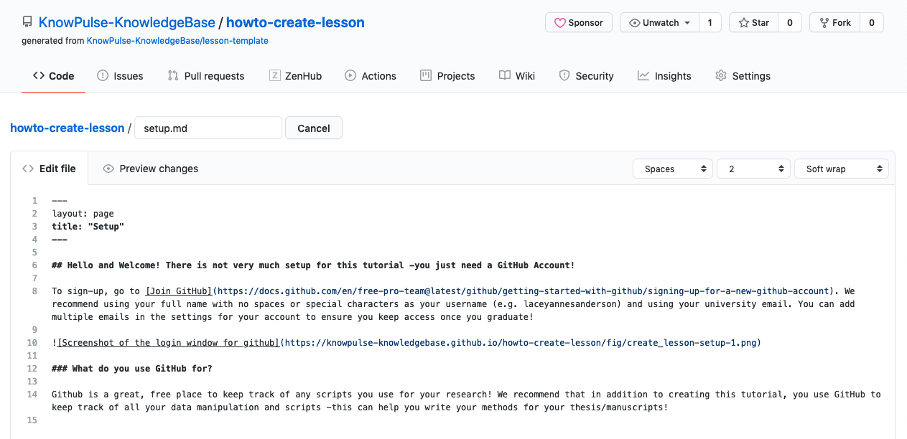

To provide setup instructions to researchers, just edit the `setup.md` page and add any content you want. I suggest including links to installation instructions for any software used.

Follow the same instructions for editing the `reference.md`. This document should include links to any reference materials, tutorials, manuals, etc. It's also a good place to highlight the most important commands and link to the most important tools.
