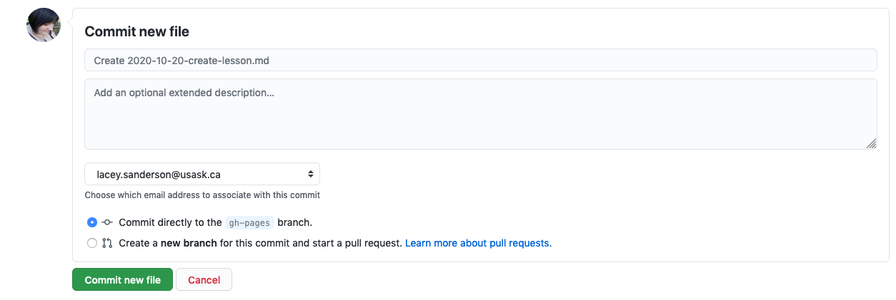

## Behind the KnowPulse KnowledgeBase listing

The KnowPulse KnowledgeBase is also a published using Github Pages! As such, you may notice it has a similar structure to your lesson repository. Since the full KnowledgeBase repository doesn't serve lessons there is no `_episode` directory but rather there is a `_posts` directory with a similar function. Just as adding episode files automatically adds to your lesson schedule, adding posts to the KnowPulse KnowledgeBase repository automatically adds to the lesson listing! Next, I'll walk you through that process in more detail.

## Adding your lesson to the listing

The first step is to create a copy of the main KnowPulse KnowledgeBase repository in your github space. This is called "Forking" a repository and is necessary to ensure you have the permissions you need to edit files. To fork the repository go to [https://github.com/KnowPulse-KnowledgeBase/KnowPulse-KnowledgeBase.github.io](https://github.com/KnowPulse-KnowledgeBase/KnowPulse-KnowledgeBase.github.io) and click on the "Fork" button at the top of the repository. This will take a minute or so and your see a progress icon shown below indicating that it's working.


Once Github is done creating the fork, it should redirect you to your new repository. It should be `[yourgithubname]/KnowPulse-KnowledgeBase.github.io` to indicate that it's your copy of the main `KnowPulse-KnowledgeBase/KnowPulse-KnowledgeBase.github.io` repository. All editing and adding of files should be completed here.

### Create a new file in `_posts` for your lesson

The next step is to create a new file in `_posts` for your lesson. To do this, click on the word `_posts` in your copy of the repository. Then click **Add file** > **Create File** at the top to create a new file in the current directory (i.e. `_posts`).


This file should be named with the current date and then the short name for your lesson (i.e. the name of your lesson repository). For example, the name of the file for this lesson is `2020-10-20-create-lesson.md` since it was added to the KnowPulse KnowledgeBase listing on October 20th, 2020 and the lesson short name is `create_lesson`. 

### Describe your lesson to the KnowledgeBase

Notice that this is a markdown file and has the same header metadata you are used to seeing in your lesson. Thus to tell the KnowPulse KnowledgeBase you simply need to fill in header metadata. To do this, copy the following template into your new file and update the metadata to match your lesson.

```
---
layout: post
title:  "How to create your own lesson"
date:   2020-10-20 09:23:13 -0600
site-url: https://knowpulse-knowledgebase.github.io/howto-create-lesson/
repo-url: https://github.com/KnowPulse-KnowledgeBase/lesson-template
maintainers: Lacey-Anne Sanderson
---
```

Make sure the maintainer is changed to your name (it can also include anyone else who is willing to help) and that the date matches the current date as provided in the name of your file. The `site-url` should be the full web address of your published lesson website and the `repo-url` should be either blank or point to a separate github repository containing example code for your lesson. The title should be the full question your lesson answers.


Then save the file to your copy of the KnowledgeBase by committing them!



### Finally, add a request to the official KnowledgeBase repository

Adding a request is done by making a **Pull Request** on the main KnowPulse KnowledgeBase repository for your changes to be merged. You can think of this as a more automated form of walking down the hall to tell me you have a lesson and the details are `_____`. By clicking on the pull request link shown in the following screenshot on the main page of your personal copy of the KnowPulse KnowledgeBase, you are creating that request.


The first thing it does is show you the changes you made to your copy. This should simply be the addition of a file to the `_post` directory with imformation about your lesson, as shown below.


Once you confirm that the changes are correct and click create pull request, it brings you to a page with a box to enter text in. You can use this as your opprotunity to convey anything you would say to me after walking down the hall. At a minimum it would be great to re-state your lesson, why it's helpful and link to the lesson repostory/website!


Then you click the **Create Pull Request** button one more time and the request is sent to me! This method makes it really easy for me to merge in your changes as, once approved, I can simply click a button and the KnowPulse KnowledgeBase will automatically be updated with your lesson added to the listing!

**Thank you So Much for contributing! At this point your lesson is available to all researchers!**
